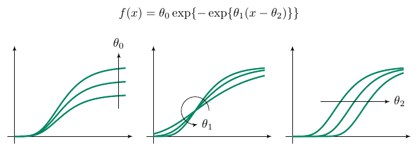

---
output:
  html_fragment
bibliography: "../../config/refs.bib"
---

## Description

The function
$$
f(x) = \theta_{a}(\exp\{-\exp\{\theta_0 - \theta_1x\}\})
$$

was basead in model given by [Benjamin Gompertz](https://www.jstor.org/stable/107756?seq=1#metadata_info_tab_contents) and is called Gompertz function or Gompertz curve.

This function is positive and have a sigmoidal format. It has three parameters:

  * $\theta_{a} > 0$ ($\mathrm{y}$) is the superior asymptote, i.e.,
    $\lim_{x \to \infty} f(x) = \theta_a$.
  * $\theta_{0} > 0$ is used to find the inflection point $f^{''}(0) = \frac{\mathrm{d^2} f}{\mathrm{d} x^2}
      \Big |_{x = 0} = \frac{\theta_0}{\theta_1}$.

  * $\theta_{1} > 0$ is the growth rate.

