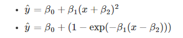

# Catálogo Web Interativo de Modelos de Regressão Não Lineares #

[Bruna Wundervald](https://gitlab.c3sl.ufpr.br/u/bdw13),
graduanda em Estatística na UFPR.  

[Walmes Zeviani](https://gitlab.c3sl.ufpr.br/u/walmes),
professor doutor do departamento de Estatística da UFPR. 

****
## Descrição do projeto ##

Modelos de regressão, no geral, são empregados para explicar o 
comportamento de uma variável resposta devido uma ou mais variáveis 
explanatórias. Os modelos lineares são chamados assim porque são 
lineares em seus parâmetros, enquanto os não lineares não os são.  

#### Exemplos de equações de modelos não lineares:

Para estes modelos, a forma como os parâmetros se relacionam com a 
função não é óbvia. Com isso, é difícil perceber se a forma destas 
funções condiz com a relaçãoentre as variáveis observadas.

#### Exemplo com curvas de um mesmo modelo variando seus parâmetros:

Com ajuda gŕafica, é mais fácil perceber como os parâmetros afetam
as curvas da equação, como é notável na imagem acima. Assim, 
este projeto tem como objetivo apresentar um catálogo interativo de 
modelos não lineares. A ideia principal do catálogo é possibilitar ao 
usuário escolher qual modelo melhor se aplica aos seus dados.

O catálogo é uma aplicação *web* que usa recursos 
interativos para alterar a forma da função através dos parâmetros. O 
usuário final interage com uma página *web*, que contém:

  - 1. o gráfico com a curva do modelo,
  - 2. uma coluna com *sliders* de alteração dos parâmetros,
e, consequentemente, da forma da curva,
  - 3. os respectivos acessórios, como botões de acesso a 
documentação e ao código-fonte.

A interface proposta contém materiais para cada modelo presente, aonde 
constam suas especificações, propriedades, aplicações e parametrizações 
conhecidas. São utilizados o software estatístico R, e o Shiny, para 
a construção da interface web. 

Os resultados, em termos gerais, são uma melhora na visualização dos 
modelos, o que leva a uma compreensão mais rápida sobre como eles 
funcionam e se relacionam com seus respectivos  parâmetros. 

O projeto está sendo desenvolvido no LEG (Laboratório de Estatística e
Geoinformação), da Universidade Federal do Paraná, em Curitiba. 
Sugestões de implementação, comentários e contribuições são bem vindas. 